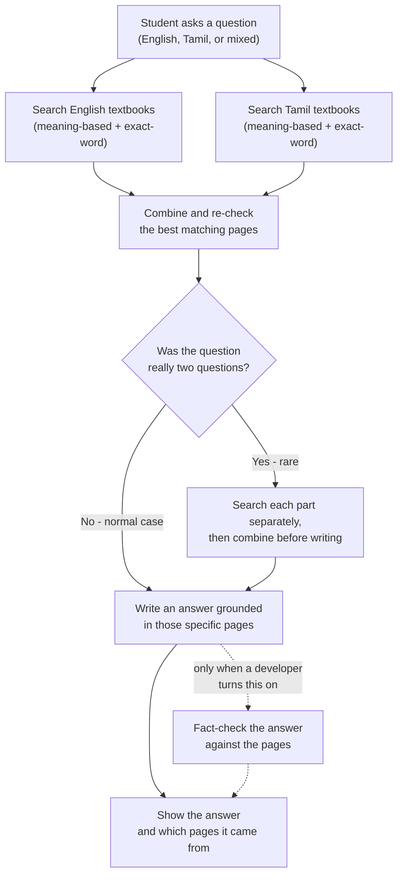
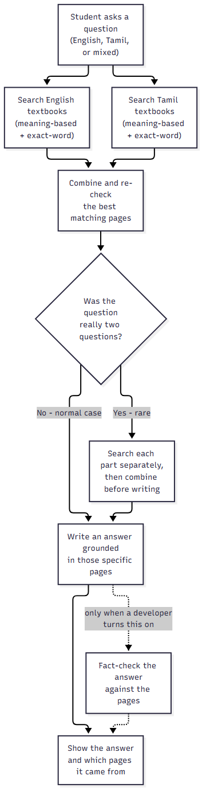
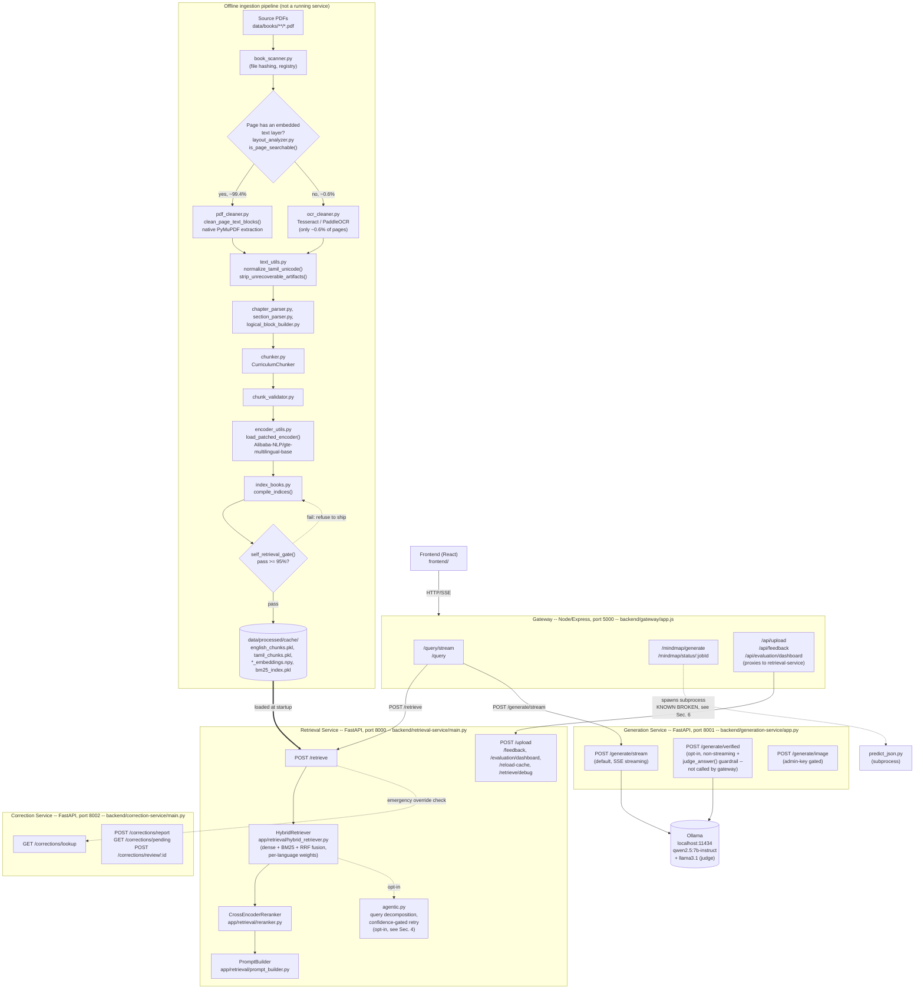
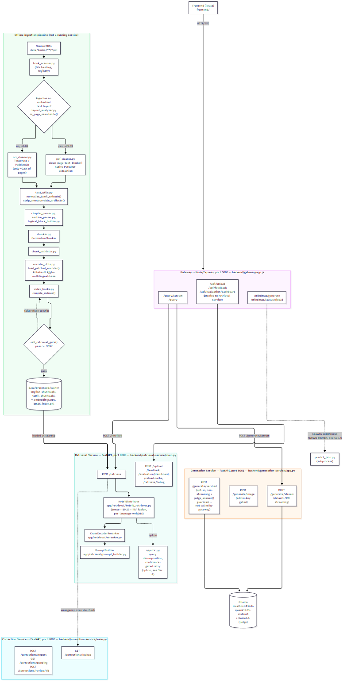
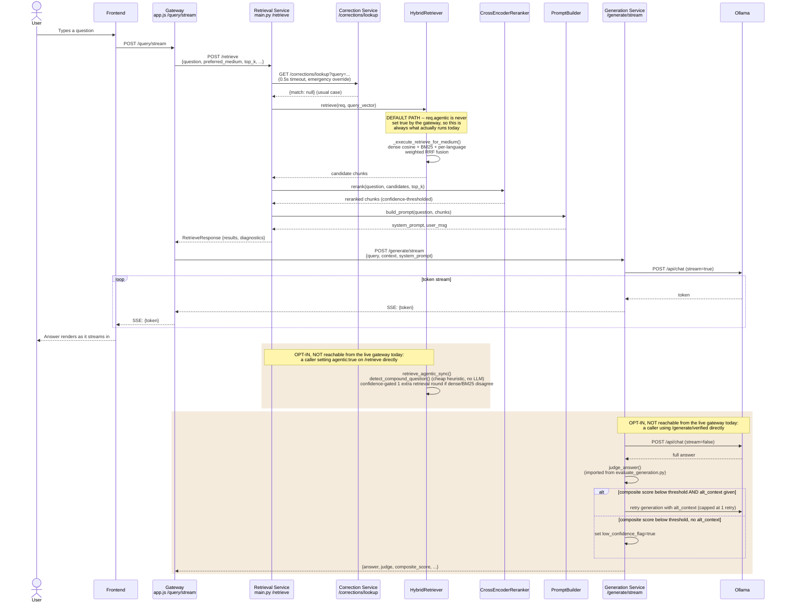

# TamilSLM Architecture

This document describes what the TamilEdu-SLM system actually does, as implemented in the code in this repository today — not what it was originally designed to do. Where a capability exists in the code but isn't used by the live app, that's called out explicitly, because it matters for understanding what a real user's question actually goes through.

---

## 1. What this system does (plain English)

A student asks a science or maths question — in English, in Tamil, or mixing the two, the way people actually talk. The system's job is to answer using the real government textbooks, not general knowledge, and to show which textbook pages it used.

Think of it like a small research desk with four people on it:

- **Two librarians** search the textbooks at the same time, each using a different method — one librarian is good at finding pages that *mean* the same thing as the question even if the words don't match exactly; the other is good at finding pages that contain the *exact words* from the question. They compare notes and combine their lists into one ranked set of candidate pages.
- **A senior editor** then looks at that combined list and re-checks it more carefully, throwing out anything that doesn't actually seem relevant once read properly, and keeping only the best handful of pages.
- **A writer** reads those pages and writes an answer in the same language mix the student used, using only what's on those pages — not outside knowledge.
- **A fact-checker** exists and can double-check the writer's answer against the pages it was given, flagging anything that looks made up — but today this fact-checker only gets called when a developer asks for it directly (via a diagnostic tool), not automatically for every student's question. For almost every real question right now, the writer's answer goes straight back to the student unchecked.

There's also a fifth capability, used only for unusually long or multi-part questions: before the librarians search, a quick check looks at whether the question is really *two* questions stuck together (like "What is X, and what is Y?"). If so, each part gets searched separately and the results get combined before the writer sees them. This never happens for an ordinary single question — it adds no extra work in the common case.

The system has a known weak spot: a meaningful slice of the Tamil textbook pages were typed using old, non-standard Tamil fonts years ago, and when the system reads the raw text out of those PDF files, a few pages come out as complete gibberish, and a larger number come out with specific letters duplicated or shuffled. This is a text-quality problem in the source files, not a flaw in how the librarians search or the writer answers — and it's actively being diagnosed and fixed page-by-page rather than papered over.

---

## 2. Top-level flow (plain language)

---

## 3. Technical architecture

Four backend services, each a separate process, plus an offline pipeline that builds the search index they query. Confirmed against the actual code in this repo — `backend/gateway`, `backend/retrieval-service`, `backend/generation-service`, `backend/correction-service` are the full current list; there is no fifth backend service.

**Why the ingestion branch matters:** `is_page_searchable()` (`app/ingestion/layout_analyzer.py`) checks whether PyMuPDF's native text extraction returns more than 100 characters. If yes, OCR never runs on that page at all — the text comes straight from the PDF's embedded font encoding. A corpus-wide scan (Phase 5 of this rebuild) found this is true for 3,992 of 4,016 pages (99.4%). This matters because the Tamil corruption found throughout this rebuild turned out to come almost entirely from *this* native-extraction path, not from OCR quality — see Section 6.

---

## 4. One request, end to end (sequence diagram)

This shows what **actually happens today** when a student asks a question through the deployed app, plus the opt-in paths that exist in the code but are not triggered by the live gateway.

---

## 5. Endpoint reference

Pulled directly from the current route definitions in each service's code, not from memory of what was built across phases.

### Gateway — Node/Express, port 5000 (`backend/gateway/app.js`)

| Method | Path | What it does | Opt-in flags |
|---|---|---|---|
| POST | `/query/stream` | Main chat endpoint. Resolves session filters (class/term/medium), calls retrieval-service then generation-service, streams the answer back over SSE, caches it and appends to session history. | `explicit_intent: "image"` routes to `/generate/image` instead of text generation. |
| POST | `/query` | Same pipeline as `/query/stream` but non-streaming — buffers the full generation-service SSE response and returns one JSON object. | — |
| POST | `/mindmap/generate` | Spawns `Mindmap/predict_json.py` as a background subprocess, returns a `jobId` immediately (202). **Currently broken** — see Section 6. | — |
| GET | `/mindmap/status/:jobId` | Polls the status/result of a mindmap job. | — |
| POST | `/api/upload` | Proxies a file upload to retrieval-service's `/upload`. | — |
| GET | `/api/upload/status/:jobId` | Proxies to retrieval-service's `/upload/status/{job_id}`. | — |
| POST | `/api/feedback` | Proxies to retrieval-service's `/feedback`. | — |
| GET | `/api/evaluation/dashboard` | Proxies to retrieval-service's `/evaluation/dashboard`. | — |

### Retrieval Service — FastAPI, port 8000 (`backend/retrieval-service/main.py`)

| Method | Path | What it does | Opt-in flags |
|---|---|---|---|
| POST | `/retrieve` | Core retrieval endpoint: correction-service override check, query encoding, hybrid retrieval, rerank, prompt building. | `agentic: bool` (default `false`) — query decomposition + confidence-gated extra retrieval round, implemented in `app/retrieval/agentic.py`. **Not set by the gateway**, so unreachable from the live app without calling this endpoint directly. `cross_corpus_fusion: bool` exists on the request schema but **this handler never reads it** — dead on the live path; the capability (`HybridRetriever.retrieve_cross_corpus_sync`) is only exercised by evaluation scripts. |
| POST | `/reload-cache` | Admin-only. Re-instantiates `HybridRetriever` to rebuild the BM25 index without downtime. | Requires `x-retrieval-service-admin-key` header. |
| POST | `/feedback` | Stores teacher feedback (correct/incorrect rating, suggested correction, flagged citations). | — |
| GET | `/evaluation/dashboard` | Admin-only. Aggregate retrieval metrics, system resource usage, teacher feedback stats. | Requires admin key. |
| POST | `/upload` | Ingests a newly uploaded book file into the corpus (background job). | — |
| GET | `/upload/status/{job_id}` | Polls an ingestion job's status. | — |
| POST | `/retrieve/debug` | Admin-only. Same as `/retrieve` but the response exposes internal diagnostics (system prompt, chunk-level scores) that `/retrieve` doesn't surface publicly. | Requires admin key. |

### Generation Service — FastAPI, port 8001 (`backend/generation-service/app.py`)

| Method | Path | What it does | Opt-in flags |
|---|---|---|---|
| POST | `/generate/stream` | Default generation endpoint. Assembles the system prompt, streams tokens from Ollama over SSE. **This is what every live user request goes through.** | — |
| POST | `/generate/verified` | Non-streaming generation + `judge_answer()` (imported directly from `evaluation/scripts/evaluate_generation.py`, not reimplemented) scoring the answer against the retrieved context. Below-threshold scores trigger one retry with `alt_context` or a `low_confidence_flag`. **Not called by the gateway** — reachable only by calling this service directly (e.g. the `evaluate_agentic.py` eval harness). | `verify: bool` (default `false`), `alt_context`, `verify_threshold` (default `3.0`), `judge_model`. |
| POST | `/summarize-session` | Produces a rolling ≤100-word summary of older conversation turns. | — |
| POST | `/generate/image` | Generates an illustrative image for a prompt, with a safety check and a cache lookup first. | Requires `x-generation-service-admin-key` header. |
| GET | `/images/{year}/{month}/{day}/{filename}` | Serves a previously generated image file. | — |
| POST | `/router/intent` | **Deprecated** (returns HTTP 410). Intent routing moved to the gateway's keyword classifier. | — |

### Correction Service — FastAPI, port 8002 (`backend/correction-service/main.py`)

| Method | Path | What it does | Opt-in flags |
|---|---|---|---|
| GET | `/corrections/lookup` | Keyword/substring match against approved corrections. Called internally by retrieval-service's `/retrieve` on every request (0.5s timeout) as an emergency-override check — **not called by the gateway directly**. | — |
| POST | `/corrections/report` | Public. Submits a reported issue (rate-limited, 5/min per IP). | — |
| GET | `/corrections/pending` | Admin-only. Lists unreviewed reports. | Requires `x-correction-service-admin-key` header. |
| POST | `/corrections/review/{report_id}` | Admin-only. Approves or rejects a reported correction. | Requires admin key. |

---

## 6. Known limitations (plain language)

- **Some Tamil textbook pages come out garbled, and this is a source-file problem, not a search or writing problem.** A handful of pages (4 found so far, out of roughly 4,000 pages in the whole Tamil+English corpus) were typed using old, non-standard Tamil fonts, and reading them back from the PDF produces complete gibberish — not OCR failure, a font-encoding problem. A much more common but milder issue (certain letter combinations getting duplicated or shuffled) affects a larger share of Tamil pages and has been identified but, as of this writing, not yet safely fixed — a wrong guess at a fix risks breaking text that was already correct, so it hasn't been applied until it can be done carefully.
- **The fact-checking step exists but isn't turned on for real student questions.** It roughly doubles how long an answer takes to come back, which isn't worth it for English questions that are already answered well — so right now it's a diagnostic tool a developer can run on demand, mainly useful for double-checking Tamil answers specifically, not something every student's question goes through.
- **Breaking a complex question into smaller parts before searching** is built and tested, but a real student's question never actually triggers it today — the app in front of users doesn't ask for that behavior yet.
- **A planned "knowledge graph" feature was evaluated and deliberately not built.** The idea was to let the system reason over relationships between concepts, not just retrieve pages. Testing showed that running this on the Tamil textbook text — given the font/text-quality problems above — produced confident-sounding answers that were simply wrong, which is worse than not having the feature at all. It was shelved on purpose, not abandoned by accident.
- **The mindmap feature is currently broken.** It depends on a trained classifier file that isn't present anywhere in this repository, so requests to it fail every time, independent of anything else in the system.

---

*This document reflects the code as of the commits through the Phase 5 legacy-font pilot (`45e434a` / `e24d1ed`). It should be re-read against the actual route files and ingestion scripts if asked for again later — don't assume this stays accurate as the code changes.*
