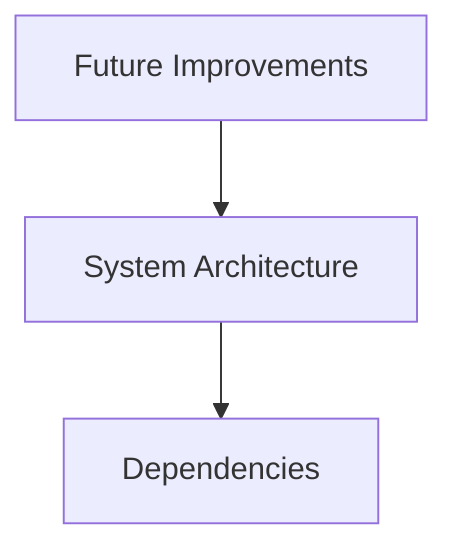

# Future Improvements

## Summary
Overview and documentation for Future Improvements.

## Purpose
To define the architecture and workflow for Future Improvements.

## Responsibilities
- Core logic for Future Improvements
- Interaction with [[System Architecture]]

## Internal Components
- [[Backend]]
- [[Frontend]]
- [[Database]]

## Related Files
- Check dynamically generated module pages.

## Dependencies
- [[Dependencies]]
- [[Third-Party Libraries]]

## Technologies Used
- Python, Node.js, Graphify, Antigravity

## Mermaid Diagram

## Important Notes
- Auto-generated via Graphify Documentation Pipeline.

## Manual Notes
<!-- MANUAL:START -->

<!-- MANUAL:END -->

## Related Documentation
- [[Home]]
- [[Project Overview]]
