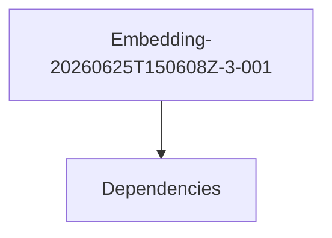

# Module Embedding-20260625t150608z-3-001

## Overview
Documentation for the `Embedding-20260625T150608Z-3-001` module.

## Internal Components
- [[System Architecture]]
- [[Dependencies]]

## Mermaid Diagram

## Manual Notes
<!-- MANUAL:START -->

<!-- MANUAL:END -->

