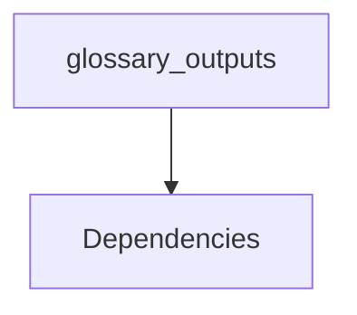

# Module Glossary_outputs

## Overview
Documentation for the `glossary_outputs` module.

## Internal Components
- [[System Architecture]]
- [[Dependencies]]

## Mermaid Diagram

## Manual Notes
<!-- MANUAL:START -->

<!-- MANUAL:END -->

