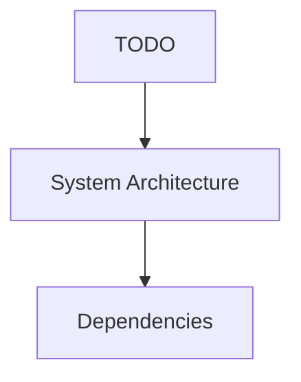

# TODO

## Summary
Overview and documentation for TODO.

## Purpose
To define the architecture and workflow for TODO.

## Responsibilities
- Core logic for TODO
- Interaction with [[System Architecture]]

## Internal Components
- [[Backend]]
- [[Frontend]]
- [[Database]]

## Related Files
- Check dynamically generated module pages.

## Dependencies
- [[Dependencies]]
- [[Third-Party Libraries]]

## Technologies Used
- Python, Node.js, Graphify, Antigravity

## Mermaid Diagram

## Important Notes
- Auto-generated via Graphify Documentation Pipeline.

## Manual Notes
<!-- MANUAL:START -->
- [ ] Add authentication to `generation-service/app.py` endpoints: `/generate/stream`, `/summarize-session`, `/router/intent`.
- [ ] Monitor the O(N) linear scan performance inside `/corrections/lookup`.

<!-- MANUAL:END -->

## Related Documentation
- [[Home]]
- [[Project Overview]]
